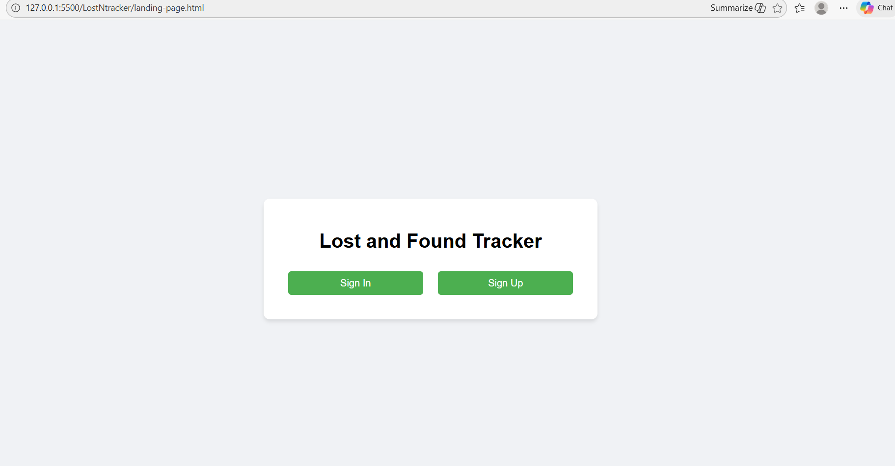
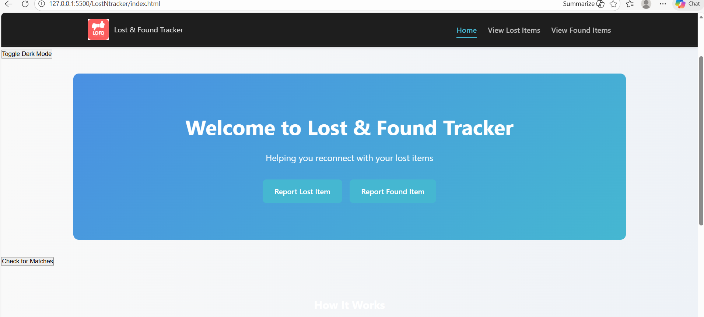
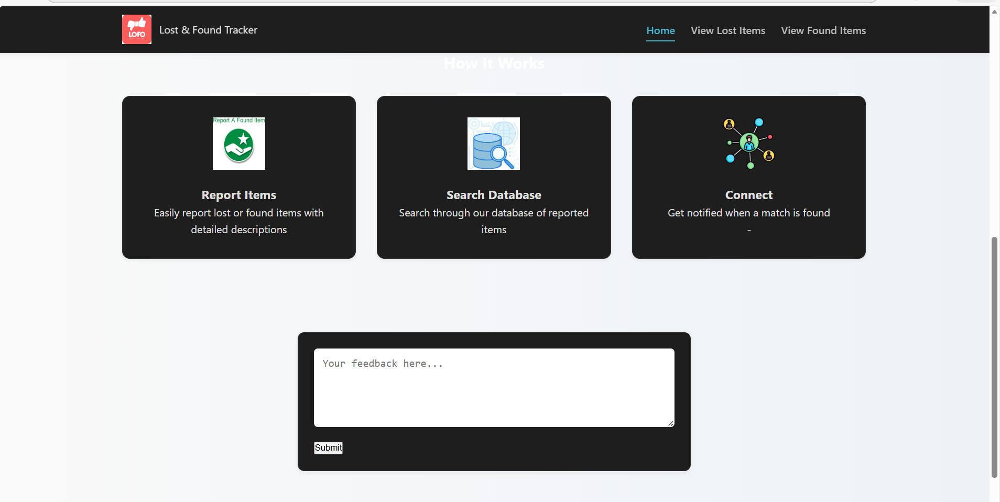

<!-- Updated README -->
# 🔍 Lost & Found Tracker

A web-based **Lost & Found Tracker** that helps users report, view, and match lost and found items.  
The project uses **Firebase Authentication** for secure login and **Google Forms + Google Sheets** for collecting and displaying item data.

---

## ✨ Features

- 🔐 **User Authentication**
  - Sign Up & Sign In using Firebase Authentication
  - Secure access to the application

- 📝 **Lost & Found Item Reporting**
  - Lost and Found items are submitted using Google Forms
  - Form responses are stored in Google Sheets

- 📊 **View Lost & Found Items**
  - Separate pages for Lost Items and Found Items
  - Data fetched dynamically from Google Sheets (CSV format)

- 🔎 **Search Functionality**
  - Search bar to filter lost and found items easily

- 🔔 **Basic Match Detection**
  - Compares lost and found item descriptions
  - Detects partial matches and shows notifications

- 🎨 **Simple & Clean UI**
  - Responsive layout
  - Easy navigation

---

## 🛠️ Tech Stack

- **Frontend**
  - HTML5
  - CSS3
  - JavaScript (ES6)

- **Authentication & Backend**
  - Firebase Authentication
  - Firebase Firestore (User Data)

- **Data Collection**
  - Google Forms
  - Google Sheets (CSV Export)

- **Libraries**
  - Firebase CDN
  - PapaParse (CSV Parsing)

---

## ⚠️ Important Note (Google Forms & Sheets Limitation)

This project uses **Google Forms** for submitting Lost and Found items.  
The responses are stored in **Google Sheets** and accessed using **public CSV links**.

Due to **Google Forms embedding and response limits**:
- Forms are **not fully embedded inside the application**
- Data is fetched from Google Sheets instead
- This avoids embedding issues and improves reliability

✅ This approach ensures smooth performance and stable data access.

---

## 📸 Screenshots

### Landing Page

### Dashboard / Home Page

### Signup Page

---
##🔮 Future Enhancements

- Replace Google Forms with Firebase Firestore
- Advanced item matching using keywords
- Email or in-app notifications
- Admin dashboard for verification
